<div align="center">



<br/>

[](https://www.npmjs.com/package/@tikron/server)
[](LICENSE.md)
[](https://tikron.dev)
[](https://discord.gg/uXnK7Czq7G)

**[🎮 Play the FPS demo](https://tikron.dev/shooter.html)** · [Dashboard](https://tikron.dev/dashboard/) · [Agent docs (AGENTS.md)](AGENTS.md) · [Measured numbers](docs/PERF.md)

</div>

---

**Source-available, server-authoritative multiplayer SDK for web games** (Tikron License 1.0 — free for any use except competing with Tikron, converts to Apache-2.0 after one year) — the "Supabase for
game netcode", but you self-host. You deploy game rooms to **your own Cloudflare account**
(Workers + Durable Objects) with a drop-in TypeScript SDK — your infrastructure, your bill,
no lock-in. Anti-cheat by construction (server authority + AOI information hiding). Optional
hosted services (leaderboards + a usage dashboard) are the only managed part — and even a
**self-hosted** room can write to the managed leaderboards with a server-side `tk_live_` secret
key, while browsers read them with a publishable `tk_pub_` key. Everything else runs on your
account.

> **Live at [tikron.dev](https://tikron.dev)** — landing, playable [.io demo](https://tikron.dev/agar.html),
> [FPS demo](https://tikron.dev/shooter.html) (subtick lag compensation + AOI priority tiers),
> developer dashboard. Building a game with an AI agent? Start at [`AGENTS.md`](AGENTS.md).
> Questions, showcase, help: **[join the Discord](https://discord.gg/uXnK7Czq7G)**.
> Measured: a single room holds **100 concurrent players cleanly on deployed Cloudflare**
> (0 drops, server tick+flush 0 ms) — see [`docs/PERF.md`](docs/PERF.md); never invent latency figures.

## Highlights

- **One Durable Object per room** on your own Cloudflare account, placed near players — serverless, no lock-in, your bill (see [`docs/COSTS.md`](docs/COSTS.md)).
- **Schema/protocol handshake** — a codec drift fails the join with an actionable error (`RoomJoinError`) instead of silently decoding corrupt state.
- **Production observability** — `Room.onError(err, ctx)` routes every caught exception (a throwing handler, `onTick`, a failed persist) to one hook; poll `tk:stats` for machine-readable drop/error counts.
- **`forcePersist()`** — close the up-to-5 s deploy/restart snapshot loss window on a critical transition.
- **Managed leaderboards from self-hosted rooms** — wire `platformLeaderboard()` with a `tk_live_` key; browsers read via a `tk_pub_` key.
- **`npx create-tikron my-game`** scaffolds a runnable project with a bundled `AGENTS.md` and a green `npm test`.

## Install

```bash
npx create-tikron my-game        # scaffold a standalone game (recommended)
# or add the SDK to an existing project:
npm i @tikron/client @tikron/server @tikron/schema partyserver
```

The published `@tikron/*` packages are at **0.5.0**. Client and server share the wire
protocol — keep both sides on a wire-compatible line: **0.3.x–0.5.x interoperate**
(0.4/0.5 add client/server APIs only); 0.1.x and 0.2.x are not wire-compatible with them.
The Highlights above (schema handshake, `Room.onError`, `forcePersist`, self-hosted managed
leaderboards) land in the **0.6** line — a lockstep release of all packages together, pending.

## Monorepo layout

```
packages/
  protocol/   @tikron/protocol — shared wire protocol (message tags, JSON + binary frames)
  client/     @tikron/client   — browser SDK (wraps PartySocket; prediction, clock sync, subtick)
  server/     @tikron/server   — authoritative room framework (presets, AOI, lag compensation)
  schema/     @tikron/schema   — binary delta state-sync (quant codec, per-field map deltas)
  sim/        @tikron/sim      — isomorphic movement math (shared client/server step + validation)
apps/
  gateway/    Cloudflare Worker + Durable Object rooms (agar / shooter / movement / tic-tac-toe)
              + matchmaker + platform API; serves the landing, demos, and dashboard
  dashboard/  developer dashboard (usage, API keys)
examples/
  starter/          "clone -> deploy in 5 min" cursor-arena template (see its README)
  discord-activity/ Discord Activity embed example
tools/
  create-tikron/    npx scaffolder for a standalone game (SDK from npm)
  loadtest/         WebSocket load-test harness (agar / movement / ttt / fps scenarios)
```

## Foundation

- **Runtime:** Cloudflare Workers + Durable Objects via [`partyserver`](https://github.com/cloudflare/partykit) (ISC).
- **Language:** TypeScript everywhere. **Package manager:** pnpm workspaces + Turborepo.
- **Tick model:** fixed-timestep `setInterval` authoritative loop; the loop drains
  inputs, records lag-comp history and flushes state each tick, so `tickMs` IS the
  network update rate (presets default to 20 Hz; the FPS demo runs its room at 60 Hz).

## Development

```bash
pnpm install
pnpm typecheck      # tsc across the workspace
pnpm test           # vitest (incl. workerd integration tests)
pnpm build          # turbo build

# run the edge gateway locally (workerd via wrangler)
pnpm --filter @tikron/gateway dev
```

## Node / toolchain

Node >= 22, pnpm 10.x, wrangler 4.x. See `.nvmrc`.

Licensed under the [Tikron License 1.0](LICENSE.md) (adapted from the Functional Source License, one-year change date) — free for any
purpose except offering a competing multiplayer-SDK/BaaS; each release converts to
Apache-2.0 after one year. Different terms (competing use, earlier Apache rights)?
Open an issue or contact the maintainers.
